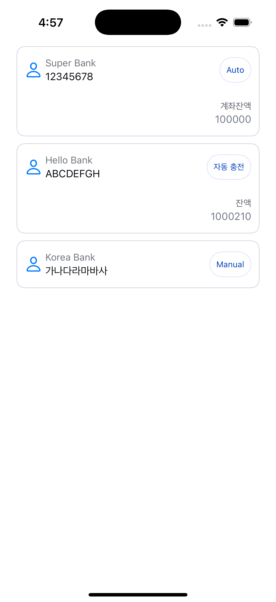
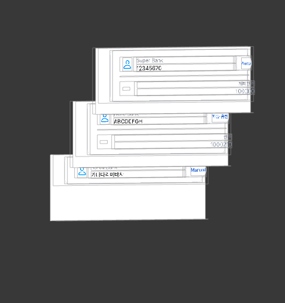
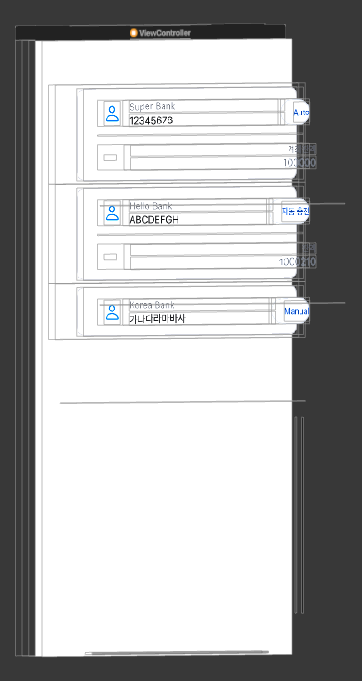

# iOS 26 UITableViewAutomaticDimension Layout Bug Sample

This is a minimal project to demonstrate a **layout issue on iOS 26** where `UITableViewAutomaticDimension` does not correctly apply dynamic cell height, unless the cell’s background color is explicitly set.

## 💡 Summary

In previous iOS versions, the following setup worked as expected:

- Auto Layout fully defined inside a `UITableViewCell` XIB
- `tableView.rowHeight = UITableView.automaticDimension`
- `estimatedRowHeight` set appropriately

However, on **iOS 26**, the layout **breaks silently**, and cell height does **not adjust** to fit its content unless a background color (e.g. `.blue`) is explicitly applied to the cell.


--- 

## Image

<p align="center">
  
  
  
</p>
<p align="center">
  <em style="display:inline-block; width:250px;">iOS 26: Layout Bug</em>
  <em style="display:inline-block; width:250px;">/ Earlier iOS: Expected cell </em>
  <em style="display:inline-block; width:250px;">/ iOS 26: Fixed by applying background color</em>
</p>

<p align="center">
  
  
</p>
<p align="center">
  <em style="display:inline-block; width:250px;">iOS 26 View Hierarchy</em>
  <em style="display:inline-block; width:250px;">/ Earlier iOS View Hierarchy</em>
</p>


---

## ✅ Setup

No special setup is required. Just run the app on a simulator or device running **iOS 26**.

---

## 🐞 Bug Description (iOS 26)

- TableView uses `UITableView.automaticDimension`
- Cell layout is defined via Auto Layout in a XIB
- When no `backgroundColor` is set on `UITableViewCell`, the content does not expand and appears clipped.

Adding the following line inside `awakeFromNib` of the cell unexpectedly fixes the layout:

```swift
self.backgroundColor = .clear // or any color
```
